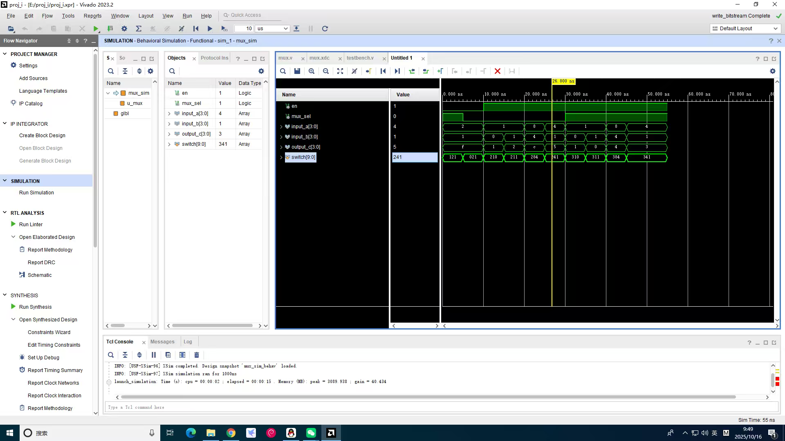
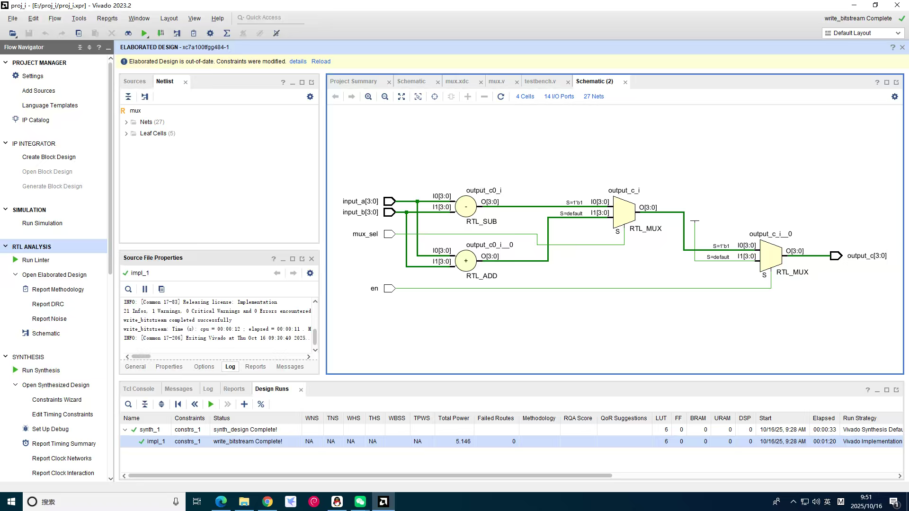
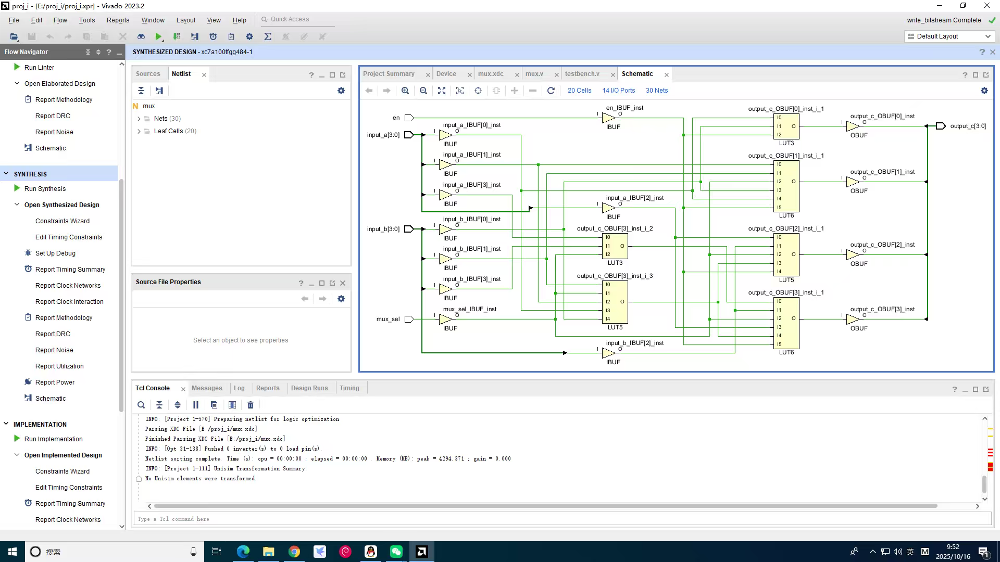
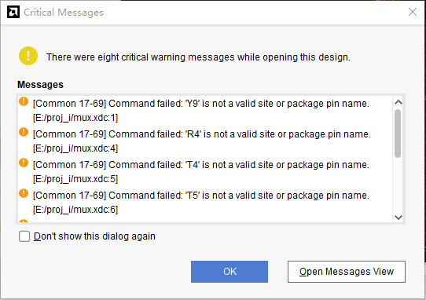

# 实验1：Vivado使用与组合电路

| 姓名 | 学号 | 班级 |
| :-: | :-: | :-: |
| 郑旭晖 | 2023311608 | 计算机与电子通信6班 |

## 一、多路复用器仿真波形分析
### 1.1 仿真波形截图

### 1.2 波形分析

答：波形功能判断与要点：
- 使能 en = 0 时，输出为全 1（output_c = 4'b1111）。
- 使能 en = 1 时：
  - mux_sel = 0：output_c = input_a + input_b（只取 4 位，溢出按低 4 位保留）。
  - mux_sel = 1：output_c = input_a - input_b（按无符号减法，只取低 4 位，负数等价于模 16 结果）。

## 二、多路复用器电路图
### 2.1 RTL Analysis（RTL分析图）截图

### 2.2 Synthesis schematic（综合后电路图）截图

## 三、请回答：
1. 比特流文件（.bit文件）默认在Vivado工程的哪个子目录下？

    答：<vivado_project_folder>/<project_name>.runs/impl_1/<top_or_design_name>.bit

2. 以指导书所给的3-8译码器工程为例，若芯片型号选成xa7a12tcpg238-2I是否可以？如果不可以，会在什么阶段出现什么样的错误？请修改测试，给出“出错的截图”，并说明怎么修改已有的Vivado工程芯片型号。

    答：不可以，会在implementation阶段报引脚不匹配错误。

    
